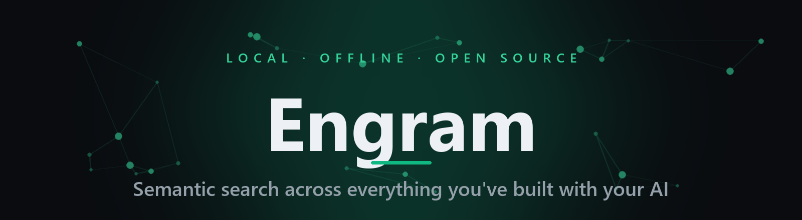

<div align="center">



**English** · [한국어](README.ko.md)

[](LICENSE)


**Engram turns your AI‑coding conversations into a private, offline, searchable memory.**
It watches the logs Claude Code (and Codex) already write, indexes them locally with a
multilingual embedding model, and gives you instant **hybrid semantic search**, a
**3D memory map**, and a clean desktop app — all on your own machine.

</div>

<!--
  ▶ Add a hero screenshot or demo GIF right here to make the top pop.
  Drop the file in docs/assets/ and uncomment (see docs/assets/README.md for how + a privacy note):

  <div align="center">
    
    <br><sub>Hybrid search · 3D semantic map · session browser — all local</sub>
  </div>

  For a playable video, drag an .mp4 into a GitHub issue/release to get a
  user-attachments URL, then paste it here (see docs/assets/README.md).
-->

---

## Why Engram

You've solved the same problem before — in a Claude Code session weeks ago. Engram makes that
past self searchable. It’s not an LLM‑recall gimmick: it’s a fast, human **omni‑search box** over
everything you've ever discussed, returning the **verbatim original** alongside an optional summary.

- 🔒 **Local & offline by default** — your conversations never leave the machine (opt‑in features are clearly marked).
- 🧠 **Hybrid semantic search** — meaning (vectors) + keywords (BM25), fused so exact terms *and* fuzzy ideas both surface.
- 🌐 **Multilingual, Korean‑first** — bundled `multilingual‑e5‑large` (int8) handles CJK and mixed text well.
- 🗺️ **3D memory map** — your history clustered into topics you can fly through.
- 🔌 **Multi‑source** — Claude Code + Codex CLI/Desktop, auto‑detected and indexed together.
- 🖥️ **One‑click desktop app** — no Python, no terminal. Windows / macOS / Linux.
- ↔️ **Multi‑device sync** — P2P via a built‑in Syncthing engine, no external install, no cloud.
- 🤖 **MCP server** — let Claude Code / Desktop search your past sessions directly.

## Download & install (desktop app)

No Python, no commands — just one installer.

<table>
<tr>
<td width="50%" valign="top">

**Windows — Installer** *(recommended)*

1. Download **`Engram-Setup-<version>.exe`** and double‑click.
2. If Windows shows *“Windows protected your PC / Unknown publisher”*, click **More info → Run anyway**. It’s simply not code‑signed yet — it’s safe.
3. Launch from **Start → Engram**. Closing the window **hides it to the tray** (indexing keeps running); to quit fully, **right‑click the tray icon → Quit**.

</td>
<td width="50%" valign="top">

**Windows — Portable** *(no install)*

Unzip **`Engram-<version>-win-x64-portable.zip`** and run **`Engram.exe`** inside. Same app — just not registered with the Start menu.

**macOS — Homebrew** *(recommended)*

```bash
brew tap flyingjoojak/chat-memory https://github.com/flyingjoojak/chat-memory
brew install --cask flyingjoojak/chat-memory/engram
brew upgrade --cask engram   # update
```

</td>
</tr>
</table>

> **Why the unsigned warning?** We haven’t attached a code‑signing certificate yet (they cost hundreds of dollars a year). Signing only removes the OS warning — it has nothing to do with the app’s function or safety.

### First run

- Pick an **embedding model** — on a slow / low‑RAM machine choose the **“recommended for low‑spec”** one. It downloads once, then indexing begins.
- Conversations index automatically as they accumulate. Use the left ribbon for **Search / Sessions / 3D map / Settings**.
- **Multiple devices:** Settings → **Device connection** → paste each other’s codes. Conversations then sync automatically.
- **Search from other AI tools:** Settings → **MCP integration** to register Claude Code / Desktop / Codex / Gemini.
- Diagnostic log: `%APPDATA%\Engram\backend.log`.

## How it works

```
Claude Code / Codex logs  →  incremental cursor read  →  turns (Q + A + actions)
      →  chunking + context  →  local embeddings (e5‑large int8)
      →  SQLite archive  +  vector index  →  hybrid search (semantic ⊕ keyword, RRF)
```

The **raw archive is the source of truth**; the vector index is a regenerable derivative, so changing
the model or re‑indexing is always lossless. Full design spec: [SPEC.md](SPEC.md).

---

<details>
<summary><b>📦  Run the standalone backend (no Electron shell)</b></summary>

<br>

Instead of the Electron app you can run **just the `chatmem-backend` folder** and use it from a browser — no Python, no install.

1. Keep the **`chatmem-backend` folder intact** and **double‑click** `chatmem-backend.exe` (all files must be present).
2. Your **browser opens automatically** after a moment (else visit `http://127.0.0.1:8765`).
3. On first run, pick an embedding model (low‑spec option available); it downloads once, then indexing begins.
4. Same features as the app — Search / Sessions / Clusters / 3D map / Settings, device connection, MCP integration. Logs live in the folder’s `data/app.log`.

</details>

<details>
<summary><b>⌨️  CLI quick start (developers)</b></summary>

<br>

Installing with [pipx](https://pipx.pypa.io) handles the virtualenv and PATH for you:

```bash
pipx install "chat-memory[web] @ git+https://github.com/flyingjoojak/chat-memory.git"
chatmem setup
```

`setup` creates the folders/config and **registers a scheduler that auto‑accumulates every 10 minutes**.
The embedding model (~2.2 GB) downloads on first run. To fill immediately: `chatmem setup --index`.

```bash
mem "how did I write the payroll calc logic"   # bare = terminal search
chatmem app                                     # desktop app (needs the [desktop] extra)
python -m chatmem.web                            # web UI → http://127.0.0.1:8642
```

</details>

<details>
<summary><b>🛠️  Install from source</b></summary>

<br>

```bash
git clone https://github.com/flyingjoojak/chat-memory.git && cd chat-memory
pip install ".[web]"          # core + web.  Enrichment: ".[all]"  ·  dev: pip install -e ".[all]"
chatmem setup
```

Extras: `[web]` web UI · `[enrich]` enrichment backends · `[mcp]` MCP server · `[all]` everything.
Installing creates the command **`chatmem`** (alias **`mem`**). Without installing, `python -m chatmem <cmd>` is identical.

</details>

<details>
<summary><b>📋  Command reference</b></summary>

<br>

```bash
chatmem setup [--index] [--no-scheduler]   # onboarding (folders, config, scheduler [, immediate backfill])
chatmem index                              # backfill / incremental indexing (the scheduler runs this)
mem "query"                                # semantic search
chatmem search "..." -k 10 --since 2026-07-01 --until 2026-07-24 --session growth
chatmem scheduler status|install|uninstall # auto-accumulation scheduler
chatmem stats | config | progress          # status · config · backfill progress
```

</details>

<details>
<summary><b>🧩  Architecture (core library + thin CLI)</b></summary>

<br>

| Module | Role |
|------|------|
| `parser.py` | Cursor‑based incremental JSONL reading (tail‑safe) · filters · turn grouping |
| `chunker.py` | Turn‑based chunking + boundary splitting of long turns + parent‑child |
| `embedder.py` | fastembed e5 (query/passage prefixes, L2 normalization) |
| `store.py` | SQLite archive (turns · chunks · cursors · enrichments · meta) |
| `vectorindex.py` | vector search (numpy / sqlite‑vec int8) |
| `indexer.py` | pipeline · holds back the incomplete last turn · contextual embedding |
| `search.py` | **hybrid search** (semantic + keyword BM25, fused via RRF) · dedup · filters · threads |
| `sources/` | pluggable source adapters (Claude Code · Codex) |
| `cli.py` | the `mem` command |

</details>

<details>
<summary><b>✨  Enrichment (summaries/tags) — pluggable backends</b></summary>

<br>

Enrichment is **optional**; search itself runs on the raw text. Pick a backend via `CHATMEM_ENRICH_BACKEND` or `--backend`:

| Backend | Description | Requirements |
|--------|------|-----------|
| `claude` (default) | Claude Code subscription (`claude -p`) | Claude Code installed & logged in |
| `anthropic` | Anthropic API | `pip install anthropic` + `ANTHROPIC_API_KEY` |
| `openai` | OpenAI (GPT) / OpenAI‑compatible server | `pip install openai` + `OPENAI_API_KEY` |
| `gemini` | Google Gemini (OpenAI‑compatible) | `pip install openai` + `GEMINI_API_KEY` |
| `ollama` | Local model (offline, free) | `pip install openai` + Ollama running |
| `off` | No enrichment (raw search only) | none |

```bash
CHATMEM_ENRICH_BACKEND=openai OPENAI_API_KEY=sk-... python -m chatmem enrich   # GPT
CHATMEM_ENRICH_BACKEND=ollama CHATMEM_OLLAMA_MODEL=llama3.1 python -m chatmem enrich   # local, zero leakage
python -m chatmem enrich --backend off                                          # turn off
```

`openai`/`gemini`/`ollama` all speak the OpenAI‑compatible API, so a single `openai` SDK handles them (LM Studio, vLLM, Groq, … work too via a custom base_url).

</details>

<details>
<summary><b>🤖  MCP server — let other AIs search your past conversations</b></summary>

<br>

Registering `chatmem-mcp` lets Claude Code, Desktop, etc. **search and view** your past sessions (local hybrid search → raw text + summary).

> **Easiest:** in the app, **Settings → MCP integration**, use the register/unregister buttons per target. Each config file is backed up as `.bak` before editing; restart the client after registering.

```bash
pip install ".[mcp]"
claude mcp add chat-memory -- chatmem-mcp      # Claude Code
```

```json
{ "mcpServers": { "chat-memory": { "command": "chatmem-mcp" } } }
```

Tools: `search_memory` · `get_session` · `recent_sessions` · `stats`. All read the same local archive.

</details>

<details>
<summary><b>⚙️  Configuration</b></summary>

<br>

Environment variables always win; otherwise `~/chat-memory/config.env` is read by the CLI, scheduler, and web UI alike. Copy [`config.env.example`](config.env.example) to start.

```bash
cp config.env.example ~/chat-memory/config.env
python -m chatmem config     # check effective config & file location
```

- `CHATMEM_DATA_DIR` — data location (default `~/chat-memory/data`)
- `CLAUDE_PROJECTS_DIR` — log source (default `~/.claude/projects`)
- `CHATMEM_EMBED_MODEL` — embedding model (changing it requires a full re‑index)
- `CHATMEM_ENRICH_BACKEND` — `claude` / `anthropic` / `openai` / `gemini` / `ollama` / `off`
- `CHATMEM_OPENAI_MODEL` / `CHATMEM_GEMINI_MODEL` / `CHATMEM_OLLAMA_MODEL` — model per backend
- `CHATMEM_OLLAMA_URL` — Ollama endpoint (default `http://localhost:11434/v1`)

> `config.env` may hold API keys and is git‑ignored. Never commit it.

</details>

## Data & privacy

By default **everything is local**. The archive (`archive.db`) and vector index live on your device at
`~/chat-memory/data`, and nothing is sent anywhere in normal use.

Data leaves the device **only via three features you opt into:**

1. **Cloud enrichment AI** — if you set the backend to Anthropic/OpenAI/Gemini, parts of conversations go to that API for summarization. `claude` (subscription), `ollama` (local) and `off` send nothing.
2. **Device sync (Syncthing)** — turning on device connection syncs logs **P2P between your own devices**, direct and encrypted, through no third‑party server. The bundled Syncthing binary is fetched from official releases and **verified via SHA‑256**.
3. **MCP integration** — a tool you register can search/view your local conversations; if it’s a cloud model, returned text may go to that model.

Otherwise: **no telemetry, no usage stats, no automatic error reports.** The “report an issue” feature sends only a masked format fingerprint — never conversation content. Secrets live only in the local config file.

<details>
<summary><b>🚀  Release &amp; versioning (maintainers)</b></summary>

<br>

Pushing a version tag (`vX.Y.Z`) makes GitHub Actions build the Windows/Linux/macOS installers and attach them to the release (including `latest.yml` for auto‑update):

1. Bump `version` in `electron/package.json`.
2. Summarize changes in `CHANGELOG.md`.
3. `git tag v0.2.0 && git push origin v0.2.0`.
4. Actions builds the 3‑OS installers and attaches them.
5. **The release body is shown as‑is in the app’s update banner** — put the CHANGELOG entry there.

> **Bilingual release notes:** split the body with `<!--lang:en-->` / `<!--lang:ko-->` markers; GitHub shows both while the app’s banner shows the section matching the user’s language.

**macOS:** unsigned apps can’t auto‑update (Squirrel.Mac needs signing), so **install/update via Homebrew** — it handles download/replacement and clears quarantine with no Gatekeeper warning. Direct‑dmg users get a banner that opens the download page. On Windows, auto‑update works from the banner even while unsigned.

</details>

## License

**MIT** — see [LICENSE](LICENSE). For device‑to‑device sync it bundles the [Syncthing](https://syncthing.net/) (MPL‑2.0) engine; other third‑party licenses are in [THIRD_PARTY_NOTICES.md](THIRD_PARTY_NOTICES.md).

<div align="center"><sub>Built for people who talk to their AI all day — and want to remember what they said.</sub></div>
